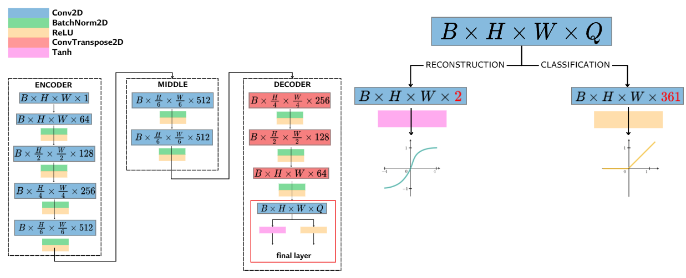

# Image-Corlorization with CIE-Lab ColorSpace
Exploring Different Machine Learning Strategies for Tackling the Image Colorization Problem

This project was inspired by this paper: [Colorful Image Colorization](https://arxiv.org/abs/1603.08511)

# Image Reconstruction Approach
- Reason why using CIE-Lab color space

- Pipeline

# Image Classification Approach
- Reason why using CIE-Lab color space

- Pipeline

# GAN Approach
- Gan Pipeline approach

# Architecture
- Reconstruction/Classification approach
    

- GAN approach
    

